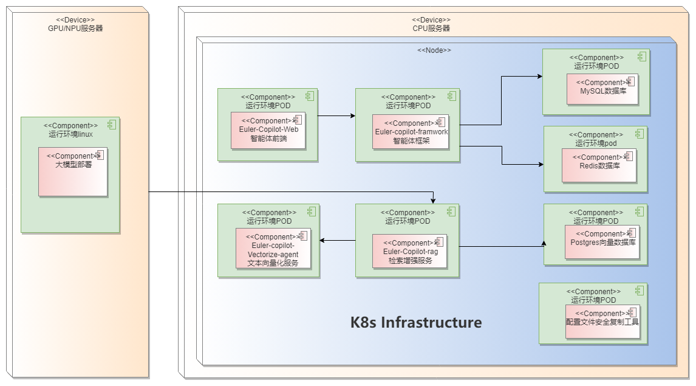

# EulerCopilot离线部署指南
## EulerCopilot介绍
EulerCopilot是一款智能问答工具，使用EulerCopilot可以解决操作系统知识获取的便捷性，并且为OS领域模型赋能开发者及运维人员。作为获取操作系统知识，使能操作系统生产力工具(如A-ops/Atune/X2openEuler/Eulermake/EulerDevops/stratovirt/iSulad等)，颠覆传统命令交付方式，由传统命令交付方式向自然语义进化，并结合智能体任务规划能力，降低开发、使用操作系统特性的门槛。

### 功能描述
  - 通过web/shell/公众号方式，覆盖在openEuler社区/社区公众号/shell 命令行界面；
  - 面向普通用户支持语言对话交流的方式，获取操作系统基础知识、欧拉基础知识、生成命令；
  - 面向运维人员支持自然语义目标意图理解，自动生成工作流，基于openEuler A-OPS/ATUNE生产力工具实现启发式诊断、调优；
  - 面向企业用户支持语义级功能特性调用，使能openEuler 主要特性(stratovirt/iSulad等)
### 应用场景
  - openEuler 在社区入口，通过自然语言方式，进行智能问答，包括但不限于：检索欧拉社区相关知识，案例；生成简单命令；对接社区基础设施；获取社区代办事项；构建社区流水线；构建软件包等。
  - shell 终端用户，基于shell 命令行增强自然语言识别能力，构建启发式运维、部署等能力，包括但不限于：智能诊断、智能调优、智能部署。
  - 端侧设备用户，通过公众号，复用社区入口能力
### 解决痛点
  - 随着操作系统规模剧增，当前操作系统覆盖的软件包超过3000+，整个规模达3.6万+，操作系统可调参数达13000+，依靠积累需要大量的学习成本；调优诊断依靠专家经验，10年以上专家诊断、调优效率是新员工的10倍以上；调优、诊断、部署过程需要掌握大量的命令，使用门槛较高。
### 关键价值
  - 通过EulerCopilot统一知识问答，知识准确率超过80%，降低重复性知识咨询问题，通过自然语言启发式运维，调优诊断部署效率倍级提升。工具通过自然语言交付，实现意图理解，生成工作流，生成命令，生成报告，生成建议，为初学者构建专家系统；

### 组件介绍

| 组件                          | 端口            | 说明                  |
| ----------------------------- | --------------- | -------------------- |
| euler-copilot-framework       | 8002 (内部端口) | 智能体框架服务         |
| euler-copilot-web             | 8080            | 智能体前端界面        |
| euler-copilot-rag             | 8005 (内部端口) | 检索增强服务           |
| euler-copilot-vectorize-agent | 8001 (内部端口) | 文本向量化服务         |
| mysql                         | 3306 (内部端口) | MySQL数据库           |
| redis                         | 6379 (内部端口) | Redis数据库           |
| postgres                      | 5432 (内部端口) | 向量数据库             |
| secret_ingect                 | 无              | 配置文件安全复制工具   |

## 环境要求
以下部署操作必须在设备保持网络连接的状态下进行。

### 软件要求

| 软件        |  版本要求                             |  说明                                |
|------------| --------------------------------------|--------------------------------------|
| 操作系统    | openEuler 22.03 LTS及以上版本、InLinux 23.12版本、FusionOS 23版本、UOS 20版本  | 确保多台服务器的系统版本一致 |
| K3s        | >= v1.29.0，带有Traefik Ingress工具   | K3s提供轻量级的 Kubernetes集群，易于部署和管理 |
| Docker     | >= v25.4.0                           | Docker提供一个独立的运行应用程序环境    |
| Helm       | >= v3.14.4                           | Helm是一个 Kubernetes的包管理工具，其目的是快速安装、升级、卸载Eulercopilot服务 |
| python     | >=3.9.9                              | python3.9.9以上版本为模型的下载和安装提供运行环境 |

### 硬件要求
#### 部署方案1


|  硬件要求      |         说明                                                        |
| -------------- | --------------------------------------------------------------------|
| 服务器         | 需要2台服务器                                                       |
| CPU            | 鲲鹏或x86_64， >= 32 cores                                          |
| RAM            | >= 64GB                                                             |
| 存储           | >= 500 GB                                                           |
| GPU/NPU        | [基于所选模型评估硬件资源需求](https://huggingface.co/spaces/hf-accelerate/model-memory-usage)|

部署视图如下图1所示



#### 部署方案2

| 硬件类型  |     说明                     |
|-----------| -----------------------------|
| 服务器    | 需要1台服务器                |
| CPU       | 鲲鹏或x86_64， >= 32 cores   |
| RAM       | >= 64GB                      |
| 存储      | >= 500 GB                    |
| GPU/NPU   | [基于所选模型评估硬件资源需求](https://huggingface.co/spaces/hf-accelerate/model-memory-usage)|

部署视图如下图2所示


## 环境准备
如果您的服务器、硬件、驱动等全部就绪，即可启动环境初始化流程，以下部署步骤在无公网环境执行。

### 1. 环境检查
环境检查主要是对服务器的主机名、DNS、防火墙设置、磁盘剩余空间大小、网络、检查SELinux的设置。
- 主机名设置
在Shell中运行如下命令：
```bash
cat /etc/hostname
echo "主机名" > /etc/hostname
```
- 系统DNS设置
  - 您需要给当前主机设置有效的DNS
- 防火墙设置
```bash
# 查看防火墙状态
systemctl status firewalld
# 查看防火墙列表
firewall-cmd --list-all
# 关闭防火墙
systemctl stop firewalld
systemctl disable firewalld
```
- SELinux设置
```bash
# 需要关闭selinux，可以临时关闭或永久关闭
# 永久关闭SELinux
sed -i 's/SELINUX=enforcing/SELINUX=disabled/g' /etc/selinux/config
# 临时关闭
setenforce 0
```
### 2. 文件下载
- 模型文件下载
    - 需要下载模型文件bge-reranker-large、bge-mixed-mode和分词工具text2vec-base-chinese-paraphrase
    - 下载链接：[https://www.alipan.com/t/bmncTBnPRGxqCYjYS2Pn]
- 镜像包下载
    - 镜像下载地址：[https://www.alipan.com/t/hlng5lj6NjVLRgNNL0mO]
- 获取安装配置库
```bash
git clone https://gitee.com/openeuler/EulerCopilot/tree/master/euler-copilot-helm.git
```
### 3. 安装部署工具
#### 3.1 安装docker
检查docker版本是否满足>= v25.4.0 ，如不满足，请升级docker版本

#### 3.2 安装K3s并导入镜像
- 安装SELinux配置文件
```bash
yum install -y container-selinux selinux-policy-base
# packages里有k3s-selinux-0.1.1-rc1.el7.noarch.rpm的离线包
rpm -i https://rpm.rancher.io/k3s-selinux-0.1.1-rc1.el7.noarch.rpm
```
- x86架构安装k3s
```bash
# 在有网络的环境上获取k3s相关包，以v1.30.3+k3s1示例
wget https://github.com/k3s-io/k3s/releases/download/v1.30.3%2Bk3s1/k3s
wget https://github.com/k3s-io/k3s/releases/download/v1.30.3%2Bk3s1/k3s-airgap-images-amd64.tar.zst
cp k3s /usr/local/bin/
cd /var/lib/rancher/k3s/agent
mkdir images
cp k3s-airgap-images-arm64.tar.zst /var/lib/rancher/k3s/agent/images
# packages里有k3s-install.sh的离线包
curl -sfL https://rancher-mirror.rancher.cn/k3s/k3s-install.sh 
INSTALL_K3S_SKIP_DOWNLOAD=true ./k3s-install.sh
```
- arm架构安装k3s
```bash
# 在有网络的环境上获取k3s相关包，以v1.30.3+k3s1示例
wget https://github.com/k3s-io/k3s/releases/download/v1.30.3%2Bk3s1/k3s-arm64
wget https://github.com/k3s-io/k3s/releases/download/v1.30.3%2Bk3s1/k3s-airgap-images-arm64.tar.zst
cp k3s-arm64 /usr/local/bin/k3s
cd /var/lib/rancher/k3s/agent
mkdir images
cp k3s-airgap-images-arm64.tar.zst /var/lib/rancher/k3s/agent/images
# packages里有k3s-install.sh的离线包
curl -sfL https://rancher-mirror.rancher.cn/k3s/k3s-install.sh 
INSTALL_K3S_SKIP_DOWNLOAD=true ./k3s-install.sh
```
- 导入镜像
```bash
# 导入已下载的镜像文件
k3s ctr image import $(镜像文件)
```

#### 3.3 安装Helm工具
以当前的最新版本“3.15.0”、x86_64架构为例，运行如下命令：
```bash
wget https://get.helm.sh/helm-v3.15.0-linux-amd64.tar.gz
tar -xzf helm-v3.15.0-linux-amd64.tar.gz
mv linux-amd64/helm /usr/sbin
rm -rf linux-amd64
```
#### 3.4 大模型准备
提供openai接口或根据硬件型号进行大模型部署，GPU服务器可参考附录的相关指令进行部署

## EulerCopilot安装

您的环境现已就绪，接下来即可启动EulerCopilot的安装流程。请打开euler-copilot-helm目录，该目录包含了EulerCopilot部署所需的所有文件。

###  1. 编辑配置文件
请参照配置文件中的注释部分进行必要的修改，下面将对内网环境详细阐述修改说明。
- 内网环境使用
  1. 确认内网IP和端口的可访问性，必要时添加白名单，以便顺利进行后续配置
  2. 修改`euler-copilot-helm/chart/values.yaml`中的domain的值为内网ip
  3. 按照如下方式修改相关配置文件：
```bash
vim euler-copilot-helm/chart_ssl/traefik-config.yml
# 修改如下部分：
websecure:
    exposedPort: port
# 将exposedPort的值port修改成要转发的端口
kubectl apply -f traefik-config.yml
```
注意：模型文件（bge-reranker-large、bge-mixed-mode和分词工具text2vec-base-chinese-paraphrase）的挂载路径需要修改正确。
###  2. 安装EulerCopilot
```bash
helm install -n euler-copilot 服务名称 .
# 服务名称可任意指定
```
###  3. 查看pod状态
```bash
kubectl -n euler-copilot get pods
# 注意：镜像拉取需要等待一分钟左右，若Pod状态均为Running，则部署成功。
# 若Pod运行出现失败情况，建议首先检查部署日志及Pod日志，以便快速定位并解决问题。
kubectl -n euler-copilot get events
kubectl logs $(pod_id) -n euler-copilot 
```
## 测试

恭喜您，EulerCopilot的部署已完成！现在，您可以开启智能问答的非凡体验之旅了。
- 内网环境
网页登录验证：`https://$(内网ip）:$(port)`

## 构建专有领域的问答
- 构建openEuler专业知识领域的智能问答
1. 修改values.yaml的pg的镜像仓为`pg-data`
2. 修改values.yaml的rag部分的字段`knowledgebaseID: openEuler_2bb3029f`
3. 将`euler-copilot-helm/chart/templates/pgsql`里面pgsql-deployment.yaml的volume相关字段注释
4. 进入`euler-copilot-helm/chart`，执行更新服务`helm upgrade -n $(name_space) $(服务名) .`
5. 进入网页端进行openEuler专业知识领域的问答
- 构建项目专属知识领域的智能问答，详细信息请查看文档《EulerCopilot本地语料上传指南.md》
## 附录
### 大模型准备
#### GPU环境部署模型时，可参考以下推荐方式
```bash
# 1.下载模型文件：
huggingface-cli download --resume-download Qwen/Qwen1.5-14B-Chat --local-dir Qwen1.5-14B-Chat
# 2.创建终端contol
screen -S contol
python3 -m fastchat.serve.controller
# 按ctrl A+D置于后台
# 3. 创建新终端 api
screen -S api
python3 -m fastchat.serve.openai_api_server --host 0.0.0.0 --port 30000  --api-keys sk-123456
# 按ctrl A+D置于后台
# 如果当前环境的python版本是3.12或者3.9可以创建python3.10的conda虚拟环境
mkdir -p /root/py310
conda create --prefix=/root/py310 python==3.10.14
conda activate /root/py310
# 4. 创建新终端worker
screen -S worker
screen -r worker
# 安装fastchat和vllm
pip install fschat vllm
# 安装依赖：
pip install fschat[model_worker]
python3 -m fastchat.serve.vllm_worker --model-path /root/models/Qwen1.5-14B-Chat/ --model-name qwen1.5 --num-gpus 8 --gpu-memory-utilization=0.7 --dtype=half
# 按ctrl A+D置于后台
# 5. 按照如下方式配置文件，并更新服务。
vim euler-copilot-helm/chart/values.yaml
修改如下部分
llm:
  # 开源大模型，OpenAI兼容接口
  openai:
    url: "http://$(IP):30000"
    key: "sk-123456"
    model: qwen1.5
    max_tokens: 8192
```
#### NPU环境部署模型待补充
