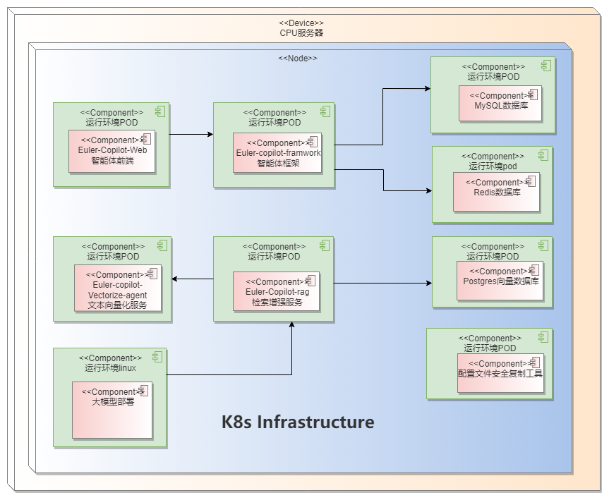

# EulerCopilot部署指南
## EulerCopilot介绍
EulerCopilot是一款智能问答工具，使用EulerCopilot可以解决操作系统知识获取的便捷性，并且为OS领域模型赋能开发者及运维人员。作为获取操作系统知识，使能操作系统生产力工具(如A-ops/Atune/X2openEuler/Eulermake/EulerDevops/stratovirt/iSulad等)，颠覆传统命令交付方式，由传统命令交付方式向自然语义进化，并结合智能体任务规划能力，降低开发、使用操作系统特性的门槛。

### 组件介绍

| 组件                          | 端口            | 说明                  |
| ----------------------------- | --------------- | -------------------- |
| euler-copilot-framework       | 8002 (内部端口) | 智能体框架服务         |
| euler-copilot-web             | 8080            | 智能体前端界面        |
| euler-copilot-rag             | 8005 (内部端口) | 检索增强服务           |
| euler-copilot-vectorize-agent | 8001 (内部端口) | 文本向量化服务         |
| mysql                         | 3306 (内部端口) | MySQL数据库           |
| redis                         | 6379 (内部端口) | Redis数据库           |
| postgres                      | 5432 (内部端口) | 向量数据库             |
| secret_ingect                 | 无              | 配置文件安全复制工具   |

## 环境要求
以下部署操作必须在设备保持连接公网的状态下进行。

### 软件要求

| 软件        |  版本要求                             |  说明                                |
|------------| --------------------------------------|--------------------------------------|
| 操作系统    | openEuler 22.03 LTS及以上版本  | 确保多台服务器的系统版本一致 |
| K3s        | >= v1.29.0，带有Traefik Ingress工具   | K3s提供轻量级的 Kubernetes集群，易于部署和管理 |
| Docker     | >= v25.4.0                           | Docker提供一个独立的运行应用程序环境    |
| Helm       | >= v3.14.4                           | Helm是一个 Kubernetes的包管理工具，其目的是快速安装、升级、卸载Eulercopilot服务 |
| python     | >=3.9.9                              | python3.9.9以上版本为模型的下载和安装提供运行环境 |

### 硬件要求
#### 部署方案1


|  硬件要求       |    说明                                                              |
| --------------  | --------------------------------------------------------------------|
| 服务器          | 需要1台服务器，调用openai模型接口                                      |
| CPU             | 鲲鹏或x86_64， >= 32 cores                                           |
| RAM             | >= 64GB                                                             |
| 存储            | >= 500 GB                                                           |

#### 部署方案2

| 硬件类型   |     说明                     |
|-----------| -----------------------------|
| 服务器     | 需要1台服务器                |
| CPU       | 鲲鹏或x86_64， >= 32 cores   |
| RAM       | >= 64GB                      |
| 存储      | >= 500 GB                    |
| GPU/NPU   | GPU支持Tesla V100 32GB、Tesla A100 40GB、Tesla V100 16GB；NPU目前仅支持910ProB和910B，大模型支持qwen1.5、星火大模型 |

#### 部署视图




## 环境初始化
如果您的服务器、硬件、驱动等全部就绪，即可启动环境初始化流程。以下是详尽的操作步骤说明及执行脚本路径，请依序操作以确保初始化顺利进行。

|      序号    | 操作内容     |    相关指令        |        说明    |
|-------------- |----------|---------------------------------------------|------------------------------------------ |
|1| 克隆仓库      |`git clone https://gitee.com/openeuler/EulerCopilot ` | 该仓库主要是Euler-Copilot部署脚本和指南 |
|2| 环境检查        | `bash EulerCopilot/euler-copilot-helm/scripts/check_env.sh`      | 主要对服务器的主机名、DNS、防火墙设置、磁盘剩余空间大小、网络、检查SELinux的设置  |
|3| 文件下载        | `bash EulerCopilot/euler-copilot-helm/scripts/download_file.sh`  | 模型bge-reranker-large、bge-mixed-mode（需要单独提供）和分词工具text2vec-base-chinese-paraphrase的下载 |
|4| 安装部署工具    | `bash EulerCopilot/euler-copilot-helm/scripts/install_tools.sh v1.30.2+k3s1 v3.15.3 cn` 注意：cn的使用是使用镜像站，可以去掉不用  | 安装helm、k3s工具  |
|5| docker检查与登录 | `bash EulerCopilot/euler-copilot-helm/scripts/prepare_docker.sh` | docker版本检查与升级、登录镜像仓      |
|6| 大模型准备      | 提供openai接口或基于硬件部署   |   使用官网的openai接口或按照附录建议方式部署  |

## EulerCopilot安装

您的环境现已就绪，接下来即可启动EulerCopilot的安装流程。请打开Euler-copilot-helm目录，该目录包含了EulerCopilot部署所需的所有文件。
###  1. 编辑配置文件
请参照配置文件中的注释部分进行必要的修改。针对公网与内网不同环境下的使用需求，下面将详细阐述相应的文件修改说明。
  1. 修改`vim EulerCopilot/euler-copilot-helm/chart/values.yaml`中的domain的值为服务器的ip
  2. 按照如下方式修改相关配置文件：
```bash
vim euler-copilot-helm/chart_ssl/traefik-config.yml
# 修改如下部分：
websecure:
    exposedPort: port
# 将exposedPort的值port修改成要转发的端口
kubectl apply -f traefik-config.yml
```
###  2. 安装EulerCopilot
```bash
helm install -n euler-copilot service .
```

###  3. 查看pod状态
```bash
kubectl -n euler-copilot get pods
# 注意：镜像拉取需要等待一分钟左右，若Pod状态均为Running，则部署成功。
# 若Pod运行出现失败情况，建议首先检查部署日志及Pod日志，以便快速定位并解决问题。
kubectl -n euler-copilot get events
kubectl logs $(pod_id) -n euler-copilot 
```
## 测试

恭喜您，EulerCopilot的部署已完成！现在，您可以开启智能问答的非凡体验之旅了。

#### 公网环境
在浏览器输入`https://$(ip):$(port)`进行智能问答测试
- 注意：这里的ip是values.yaml设置的ip, port默认值为8080

## 构建专有领域的问答
- 构建openEuler专业知识领域的智能问答
1. 修改values.yaml的pg的镜像仓为`pg-data`
2. 修改values.yaml的rag部分的字段`knowledgebaseID: openEuler_2bb3029f`
3. 将`euler-copilot-helm/chart/templates/pgsql`里面pgsql-deployment.yaml的volume相关字段注释
4. 进入`euler-copilot-helm/chart`，执行更新服务`helm upgrade -n $(name_space) $(服务名) .`
5. 进入网页端进行openEuler专业知识领域的问答
- 构建项目专属知识领域的智能问答，详细信息请查看文档《EulerCopilot本地语料上传指南.md》

## 附录
### 大模型准备
#### GPU环境部署模型时，可参考以下推荐方式
```bash
# 1.下载模型文件：
huggingface-cli download --resume-download Qwen/Qwen1.5-14B-Chat --local-dir Qwen1.5-14B-Chat
# 2.创建终端contol
screen -S contol
python3 -m fastchat.serve.controller
# 按ctrl A+D置于后台
# 3. 创建新终端 api
screen -S api
python3 -m fastchat.serve.openai_api_server --host 0.0.0.0 --port 30000  --api-keys sk-123456
# 按ctrl A+D置于后台
# 如果当前环境的python版本是3.12或者3.9可以创建python3.10的conda虚拟环境
mkdir -p /root/py310
conda create --prefix=/root/py310 python==3.10.14
conda activate /root/py310
# 4. 创建新终端worker
screen -S worker
screen -r worker
# 安装fastchat和vllm
pip install fschat vllm
# 安装依赖：
pip install fschat[model_worker]
python3 -m fastchat.serve.vllm_worker --model-path /root/models/Qwen1.5-14B-Chat/ --model-name qwen1.5 --num-gpus 8 --gpu-memory-utilization=0.7 --dtype=half
# 按ctrl A+D置于后台
# 5. 按照如下方式配置文件，并更新服务。
vim euler-copilot-helm/chart/values.yaml
修改如下部分
llm:
  # 开源大模型，OpenAI兼容接口
  openai:
    url: "http://$(IP):30000"
    key: "sk-123456"
    model: qwen1.5
    max_tokens: 8192
```
#### NPU环境部署模型待补充