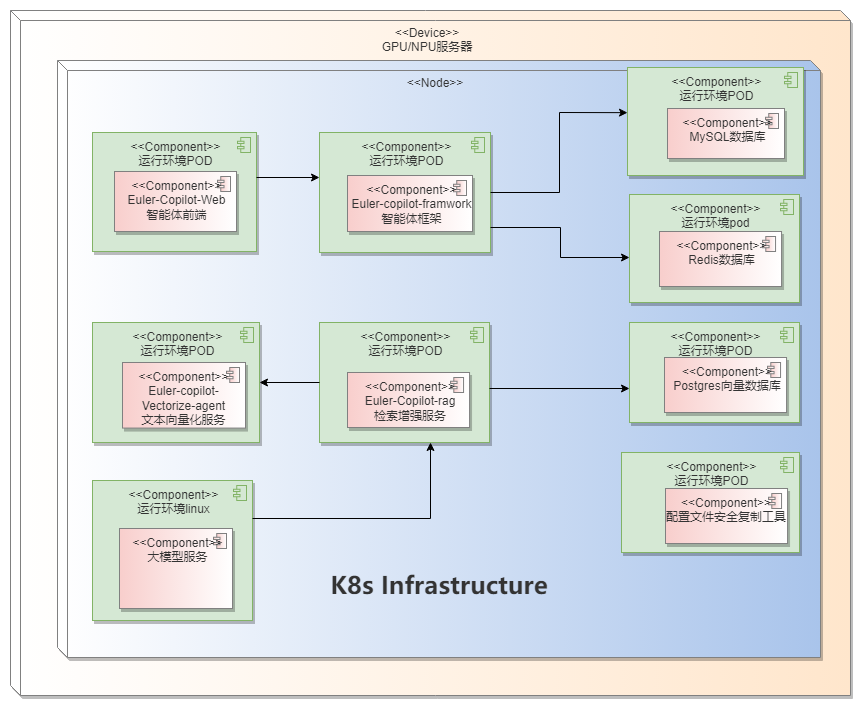
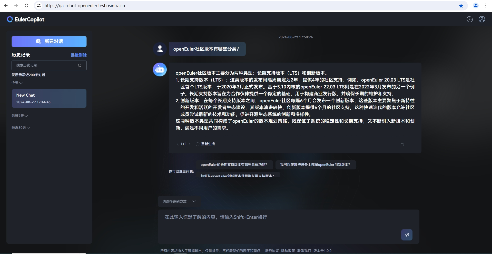

# EulerCopilot部署指南
## EulerCopilot介绍
EulerCopilot是一款智能问答工具，使用EulerCopilot可以解决操作系统知识获取的便捷性，并且为OS领域模型赋能开发者及运维人员。作为获取操作系统知识，使能操作系统生产力工具(如A-ops/Atune/X2openEuler/EulerMaker/EulerDevops/stratovirt/iSulad等)，颠覆传统命令交付方式，由传统命令交付方式向自然语义进化，并结合智能体任务规划能力，降低开发、使用操作系统特性的门槛。

### 组件介绍

| 组件                          | 端口            | 说明                  |
| ----------------------------- | --------------- | -------------------- |
| euler-copilot-framework       | 8002 (内部端口) | 智能体框架服务         |
| euler-copilot-web             | 8080            | 智能体前端界面        |
| euler-copilot-rag             | 8005 (内部端口) | 检索增强服务           |
| euler-copilot-vectorize-agent | 8001 (内部端口) | 文本向量化服务         |
| mysql                         | 3306 (内部端口) | MySQL数据库           |
| redis                         | 6379 (内部端口) | Redis数据库           |
| postgres                      | 5432 (内部端口) | 向量数据库             |
| secret_ingect                 | 无              | 配置文件安全复制工具   |

## 环境要求
### 软件要求

| 类型        |  版本要求                         |  说明                                |
|------------| -------------------------------------|--------------------------------------|
| 操作系统    | openEuler 22.03 LTS及以上版本         | 无                                   |
| K3s        | >= v1.29.0，带有Traefik Ingress工具   | K3s提供轻量级的 Kubernetes集群，易于部署和管理 |
| Docker     | >= v25.4.0                           | Docker提供一个独立的运行应用程序环境    |
| Helm       | >= v3.14.4                           | Helm是一个 Kubernetes的包管理工具，其目的是快速安装、升级、卸载Eulercopilot服务 |
| python     | >=3.9.9                              | python3.9.9以上版本为模型的下载和安装提供运行环境 |
 
### 硬件要求
| 类型           |     硬件要求                  | 
|----------------| -----------------------------|
| 服务器         | 1台                           |
| CPU           | 鲲鹏或x86_64，>= 32 cores     |
| RAM           | >= 64GB                      |
| 存储          | >= 500 GB                    |
| GPU           | Tesla V100 16GB，4张         |
| NPU           | 910ProB、910B                |

注意： 
1. 若无GPU或NPU资源，建议通过调用openai接口的方式来实现功能。(接口样例：https://dashscope.aliyuncs.com/compatible-mode/v1/chat/completions)
2. 调用openai接口的方式不需要安装高版本的docker(>= v25.4.0)、python(>=3.9.9)

### 部署视图


## 获取EulerCopilot
- 从EulerCopilot的官方Git仓库[EulerCopilot](https://gitee.com/openeuler/EulerCopilot)下载最新的部署仓库
- 如果您正在使用Kubernetes，则不需要安装k3s工具。

## 环境准备
设备需联网并符合EulerCopilot的最低软硬件要求。确认服务器、硬件、驱动等准备就绪后，即可开始环境准备工作。请按提供的操作步骤和脚本路径依次执行，以确保初始化成功。

|      序号    | 操作内容     |    相关指令        |        说明    |
|-------------- |----------|---------------------------------------------|------------------------------------------ |
|1| 环境检查        | `bash EulerCopilot/euler-copilot-helm/scripts/check_env.sh`      | 主要对服务器的主机名、DNS、防火墙设置、磁盘剩余空间大小、网络、检查SELinux的设置  |
|2| 文件下载        | `bash EulerCopilot/euler-copilot-helm/scripts/download_file.sh`  | 模型bge-reranker-large、bge-mixed-mode（需要单独提供）和分词工具text2vec-base-chinese-paraphrase的下载 |
|3| 安装部署工具    | `bash EulerCopilot/euler-copilot-helm/scripts/install_tools.sh v1.30.2+k3s1 v3.15.3 cn` 注意：cn的使用是使用镜像站，可以去掉不用  | 安装helm、k3s工具  |
|4| docker检查与登录 | `bash EulerCopilot/euler-copilot-helm/scripts/prepare_docker.sh` | docker版本检查与升级、登录镜像仓      |
|5| 大模型准备      | 提供openai接口或基于硬件部署   |   使用官网的openai接口或按照附录建议方式部署  |

## EulerCopilot安装

您的环境现已就绪，接下来即可启动EulerCopilot的安装流程。

###  1. 编辑配置文件
```bash
# 请打开开EulerCopilot/euler-copilot-helm仓库，该目录包含了EulerCopilot部署所需的所有文件。
vim EulerCopilot/euler-copilot-helm/chart/values.yaml
# 以下是values.yaml文件的全部内容，请参照配置文件中的注释部分进行必要的修改
# 全局设置
globals:
  # 部署实例数
  replicaCount: 1
  # 镜像仓库
  imageRegistry: "swr.cn-southwest-2.myhuaweicloud.com/euler-copilot"
  # 镜像仓库鉴权
  imagePullSecrets:
    - name: euler-copilot-registry
  # 镜像拉取策略
  imagePullPolicy: IfNotPresent
  # 部署域名
  domain: ""   # 需要修改为域名或内网IP
  # 大模型配置
  llm:
    # 开源大模型，OpenAI兼容接口
    openai:
      url: ""   # 需要根据大模型部署修改
      key: ""   # 需要根据大模型部署修改
      model: "Qwen1.5-32B-chat-GPTQ-Int4"   # 需要根据大模型部署修改
      max_tokens: 8192
    # Llama模型，用于部分功能场景
    llama:
      url: ""
      key: ""

euler_copilot:
  # 复制配置文件用的InitContainer的设置
  init:
    # 镜像设置
    image:
      # 镜像仓库。留空则使用全局设置。
      registry: ""
      # 镜像名
      repository: secret_inject
      # 镜像标签
      tag: latest           # ARM架构tag修改为arm
      # 拉取策略。留空则使用全局设置。
      imagePullPolicy: ""
  
  # 部署Framework所需MySQL实例
  mysql:
    enabled: true
    # 镜像设置
    image:
      # 镜像仓库。留空则使用全局设置。
      registry: ""
      # 镜像名
      repository: mysql
      # 镜像标签
      tag: "8"      # ARM架构tag修改为8-arm
      # 拉取策略。留空则使用全局设置。
      imagePullPolicy: ""
    # 性能限制设置
    resources: {}
    # Volume大小设置
    persistentVolumeSize: 10Gi
    # 密码设置
    passwords:
      userPassword: "8URM%HtCHQPxKe$u"
      rootPassword: "8ZMTsY4@dgWZqoM6"
    # Service设置
    service:
      # Service类型，ClusterIP或NodePort
      type: ClusterIP
      nodePort: 
  
  # 部署Framework所需Redis实例
  redis:
    enabled: true
    # 镜像设置
    image:
      # 镜像仓库。留空则使用全局设置。
      registry: ""
      # 镜像名
      repository: redis
      # 镜像标签
      tag: alpine   # ARM架构tag修改alpine-arm
      # 拉取策略。留空则使用全局设置
      imagePullPolicy: ""
    # 性能限制设置
    resources: {}
    # 容器根目录只读
    readOnly: false
    # 密码设置
    redisPassword: "8FDk2rnhxVPvkSdb"
    # Service设置
    service:
      # Service类型，ClusterIP或NodePort
      type: ClusterIP
      nodePort: 
  
  # 部署RAG所需PostgreSQL实例
  pgsql:
    enabled: true
    # 镜像设置
    image:
      # 镜像仓库。留空则使用全局设置。
      registry: "hub.oepkgs.net/neocopilot"
      # 镜像名
      repository: pgsql-empty  # 带语料的pg镜像名是pgsql-data
      # 镜像标签
      tag: pg16     # ARM架构tag修改pg16-arm
      # 拉取策略。留空则使用全局设置。
      imagePullPolicy: ""
    # 性能限制设置
    resources: {}
    # Volume大小设置
    persistentVolumeSize: 10Gi
    # Service设置
    service:
      # Service类型，ClusterIP或NodePort
      type: ClusterIP
      nodePort: 
    # 密码设置
    passwords:
      userPassword: "123456"

  # 部署Vectorize
  vectorize:
    enabled: true
    # 镜像设置
    image:
      # 镜像仓库。留空则使用全局设置。
      registry: ""
      # 镜像名
      repository: euler-copilot-vectorize-agent
      # 镜像标签
      tag: "20240430"    # ARM架构tag修改20240430-arm
      # 拉取策略。留空则使用全局设置。
      imagePullPolicy: ""
    # 容器根目录只读
    readOnly: true
    # 性能限制设置
    resources: {}
    # Volume设置
    volume:
      # bge模型的位置
      models: /home/euler-copilot/models 
    # Service设置
    service:
      # Service类型，ClusterIP或NodePort
      type: ClusterIP
      nodePort: 
    model:
      embedding: bge-mixed-model
      rerank: bge-reranker-large

  # 部署RAG
  rag:
    enabled: true
    # 镜像设置
    image:
      # 镜像仓库。留空则使用全局设置。
      registry: "hub.oepkgs.net/neocopilot"
      # 镜像名
      repository: euler-copilot-rag
      # 镜像标签
      tag: "430-release"   # ARM架构tag修改430-release-arm
      # 拉取策略。留空则使用全局设置
      imagePullPolicy: ""
    # 容器根目录只读
    readOnly: false
    # 性能限制设置
    resources: {}
    # Service设置
    service:
      # Service类型，ClusterIP或NodePort
      type: ClusterIP
      nodePort: 
      nodePortDagster: 
    # RAG内知识库名
    knowledgebaseID: default_test
    # 待向量化的文档位置
    docs_dir: "/home/euler-copilot/docs"  # 需要修改为语料文档目录
  
  # 部署Framework
  framework:
    enabled: true
    # 镜像设置
    image:
      # 镜像仓库。留空则使用全局设置。
      registry: ""
      # 镜像名
      repository: euler-copilot-framework
      # 镜像标签
      tag: "20240430"     # ARM架构tag修改20240430-arm
      # 拉取策略。留空则使用全局设置
      imagePullPolicy: ""
    # 容器根目录只读
    readOnly: true
    # 性能限制设置
    resources: {}
    # Service设置
    service:
      # Service类型，ClusterIP或NodePort
      type: ClusterIP
      nodePort:
    # Volume设置
    volume:
      text2vec: /home/euler-copilot/text2vec-base-chinese-paraphrase
    # JWT Key
    jwtKey: 6vJZbyFlfJgXFAuNlQaUdOChVLm5aLTC
  
  # 部署Web
  web:
    enabled: true
    # 镜像设置
    image:
      # 镜像仓库。留空则使用全局设置。
      registry: ""
      # 镜像名
      repository: euler-copilot-web
      # 镜像标签
      tag: "20240430"    # ARM架构tag修改20240430-arm
      # 拉取策略。留空则使用全局设置
      imagePullPolicy: ""
    # 容器根目录只读
    readOnly: true
    # 性能限制设置
    resources: {}
    # Service设置
    service:
      # Service类型，ClusterIP或NodePort
      type: ClusterIP
      nodePort: 
    # Ingress设置
    ingress:
      # 是否启用Ingress
      enabled: true
      # Ingress前缀
      prefix: /

```
1. 修改`vim EulerCopilot/euler-copilot-helm/chart/values.yaml`domain为服务器的host_ip。
2. 修改openai的url、key、model、max_token为实际部署的值。
3. 将values.yaml中指定的章节（vectorize、rag、framework）中bge模型、带向量化的文档及分词工具的位置更新为服务器上文件的实际路径。
4. 内网下可按照如下方式修改traefik-config.yml，将默认的web端口8080进行转发：
```bash
vim euler-copilot-helm/chart_ssl/traefik-config.yml
# 修改如下部分：
websecure:
    exposedPort: port
# 将exposedPort的值port修改成要转发的端口
kubectl apply -f traefik-config.yml
```
###  2. 安装EulerCopilot
```bash
helm install -n euler-copilot service .
```

###  3. 查看pod状态
```bash
kubectl -n euler-copilot get pods
root@openeuler:~# kubectl -n euler-copilot get pods
NAME                                          READY   STATUS    RESTARTS   AGE
framework-deploy-opengauss-bb5b58678-jxzqr    2/2     Running   0          16d
mysql-deploy-opengauss-c7857c7c9-wz9gn        1/1     Running   0          17d
pgsql-deploy-opengauss-86b4dc4899-ppltc       1/1     Running   0          17d
rag-deploy-opengauss-5b7887644c-sm58z         2/2     Running   0          110m
redis-deploy-opengauss-f8866b56-kj9jz         1/1     Running   0          17d
vectorize-deploy-opengauss-57f5f94ccf-sbhzp   2/2     Running   0          17d
web-deploy-opengauss-74fbf7999f-r46rg         1/1     Running   0          2d
# 注意：镜像拉取需要等待一分钟左右，若Pod状态均为Running，则部署成功。
# 若Pod运行出现失败情况，检查EulerCopilot的日志以确保服务正在正常运行。。
kubectl -n euler-copilot get events
kubectl logs $(pod_name) -n euler-copilot 
```

## 验证安装

访问EulerCopilot Web界面，请在浏览器中输入https://$(host_ip):8080（其中port默认值为8080，若更改则需相应调整）。

### 1. 创建登录账号密码
``` bash
# 首次登录触发mysql数据库生成user表
# 1.生成加密后的账号密码
[root@op2203-01 model]# python3
Python 3.9.9 (main, Mar 15 2022, 00:00:00) 
[GCC 10.3.1] on linux
Type "help", "copyright", "credits" or "license" for more information.
>>> import hashlib
>>> hashlib.sha256("密码".encode('utf-8')).hexdigest()
# 保存生成的加密密码
# 2.插入账号密码到mysql数据库
kubectl -n $(namespace) exec -it $(pod_name) -- bash
bash-5.1# mysql -uroot -p8ZMTsY4@dgWZqoM6
# 密码在EulerCopilot/euler-copilot-helm/chart/values.yaml的myslq章节查看
mysql> use euler_copilot;
mysql> insert into user(user_sub, passwd) values ("用户名", "加密后的密码");
mysql> exit;
```
### 2. 问答验证

恭喜您，EulerCopilot的部署已完成！现在，您可以开启智能问答的非凡体验之旅了。



## 构建专有领域的问答
### 构建openEuler专业知识领域的智能问答
  1. 修改values.yaml的pg的镜像仓为`pg-data`
  2. 修改values.yaml的rag部分的字段`knowledgebaseID: openEuler_2bb3029f`
  3. 将`vim EulerCopilot/euler-copilot-helm/chart/templates/pgsql/pgsql-deployment.yaml`的volume相关字段注释
  4. 进入`cd EulerCopilot/euler-copilot-helm/chart`，执行更新服务`helm upgrade -n euler-copilot server .`
  5. 进入网页端进行openEuler专业知识领域的问答
### 构建项目专属知识领域智能问答
详细信息请参考文档《EulerCopilot本地语料上传指南.md》

## 附录
### 大模型准备
#### GPU环境部署模型时，可参考以下推荐方式
```bash
# 1.下载模型文件：
huggingface-cli download --resume-download Qwen/Qwen1.5-14B-Chat --local-dir Qwen1.5-14B-Chat
# 2.创建终端contol
screen -S contol
python3 -m fastchat.serve.controller
# 按ctrl A+D置于后台
# 3. 创建新终端 api
screen -S api
python3 -m fastchat.serve.openai_api_server --host 0.0.0.0 --port 30000  --api-keys sk-123456
# 按ctrl A+D置于后台
# 如果当前环境的python版本是3.12或者3.9可以创建python3.10的conda虚拟环境
mkdir -p /root/py310
conda create --prefix=/root/py310 python==3.10.14
conda activate /root/py310
# 4. 创建新终端worker
screen -S worker
screen -r worker
# 安装fastchat和vllm
pip install fschat vllm
# 安装依赖：
pip install fschat[model_worker]
python3 -m fastchat.serve.vllm_worker --model-path /root/models/Qwen1.5-14B-Chat/ --model-name qwen1.5 --num-gpus 8 --gpu-memory-utilization=0.7 --dtype=half
# 按ctrl A+D置于后台
# 5. 按照如下方式配置文件，并更新服务。
vim euler-copilot-helm/chart/values.yaml
修改如下部分
llm:
  # 开源大模型，OpenAI兼容接口
  openai:
    url: "http://$(IP):30000"
    key: "sk-123456"
    model: qwen1.5
    max_tokens: 8192
```
#### NPU环境部署模型待补充
